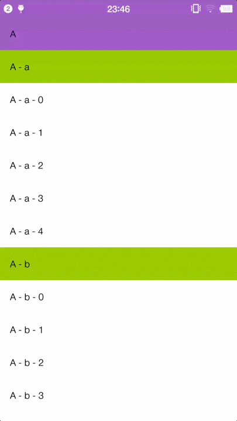

# Overview
An Android library for double level section headers that stick to the top of list. Android widget especially for displaying items with multilevel classification.



# Usage
#### 1. Include the library in your project.  

To include with Gradle:
  
Add the code below to your module-level `build.gradle`:
  
```groovy
dependencies {
   compile 'com.kenber.doublestickyheaderslist:library:1.0.0'
}
```

#### 2. Replace your `ListView` with `com.kenber.view.DoubleStickyHeaderListView` in the `layout.xml` file.

```xml
<com.kenber.view.DoubleStickyHeaderListView
    android:layout_width="match_parent"
    android:layout_height="wrap_content" />
```

#### 3. Make the `adapter` for your `DoubleStickyHeaderListView` implements `DoubleStickHeadersListAdapter` interface. You need to override the method `getHeaderLevel(int position)` to tell the `DoubleStickyHeaderListView` which header should be sticky as level 0 or level 1, or not sticky as level 2.

```java
public class ListAdapter extends ArrayAdapter<ListItem> implements DoubleStickHeadersListAdapter {

    ...
        
    @Override
    public int getHeaderLevel(int position) {
        return getItem(position).level;
    }
}
```
For now, everything is done. An example for this library can be found in `example` folder.
If you have any advice for this project, please contact me - kenberspeng@gmail.com  

Thanks
=======

[beworker](https://github.com/beworker)

I got the inspiration from his project [pinned-section-listview](https://github.com/beworker/pinned-section-listview)

License
=======

    Copyright 2016 Kenber

    Licensed under the Apache License, Version 2.0 (the "License");
    you may not use this file except in compliance with the License.
    You may obtain a copy of the License at

       http://www.apache.org/licenses/LICENSE-2.0

    Unless required by applicable law or agreed to in writing, software
    distributed under the License is distributed on an "AS IS" BASIS,
    WITHOUT WARRANTIES OR CONDITIONS OF ANY KIND, either express or implied.
    See the License for the specific language governing permissions and
    limitations under the License.
